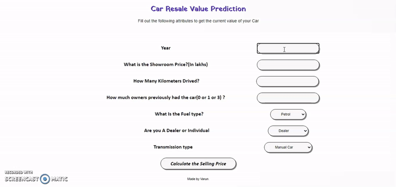

# Car-Value-Prediction

  

## Objective

The objective of this project is to calculate the <strong>resale value of a car</strong> based on various parameters such as year of purchase, type of owner, etc.

## Live Demo

<a href="https://carvaluepred.herokuapp.com/">Car Value Prediction</a>

  ### Glimpse of the Web App
  <br>

  

## Installation
The Code is written in Python 3.7. If you don't have Python installed you can find it [here](https://www.python.org/downloads/). If you are using a lower version of Python you can upgrade using the pip package, ensuring you have the latest version of pip. To install the required packages and libraries, run this command in the project directory after [cloning](https://www.howtogeek.com/451360/how-to-clone-a-github-repository/) the repository:
```bash
pip install -r requirements.txt
```

## Directory Tree 
```
├── static 
│   ├── style.css
├── templates
│   ├── index.html
├── CAR DETAILS FROM CAR DEKHO.csv
├── Car Price Prediction.ipynb
├── Procfile
├── README.md
├── app.py
├── car data.csv
├── carvaluepred.gif
├── model.pkl
├── requirements.txt
```

## Dataset

The dataset is taken from kaggle. This dataset contains information about used cars listed on www.cardekho.com. The dataset link is given <a href="https://www.kaggle.com/nehalbirla/vehicle-dataset-from-cardekho">here</a>.

## Code

The code for the model, algorithms used and accuracy of the model can be found <a href="https://github.com/VarunV991/Car-Value-Prediction/blob/master/Car%20Price%20Prediction.ipynb">here</a>.

## Web App and Deployment

This project uses Flask for the web app and its deployment is done on Heroku.

#### Other Info
This project is a modified version of an older project on the same topic.The original project is available <a href="https://github.com/krishnaik06/Car-Price-Prediction">here</a>.
